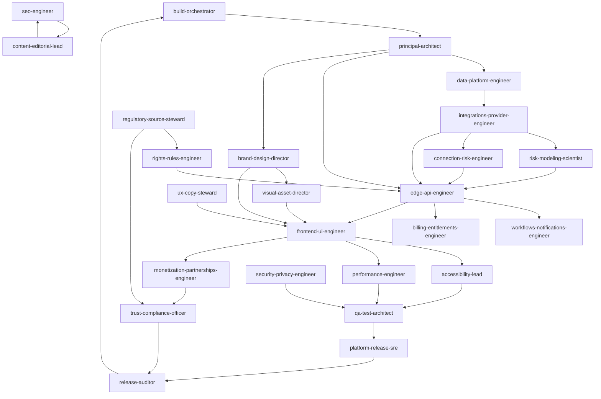

# DelayPilot Subagent Roster

Companion to `AGENTS.md` (invariants) and `DIRECTIVE.md` (what gets built, in what order).
This file answers three questions: **who exists**, **who owns which files**, and **who hands off
to whom**.

Every agent in §2 has a runnable charter at `.claude/agents/<name>.md`.

---

## 1. Design principles of this roster

1. **Single writer per path.** Concurrency is safe only because ownership is exclusive (`§3`).
2. **Builders and reviewers are different agents.** The agent that ships ads does not certify ad
   policy; the agent that writes the rights engine does not certify the sources it encodes.
   Self-certification is the failure mode this roster exists to prevent.
3. **Legally and statistically dangerous surfaces get dedicated owners.** Passenger rights,
   regulatory sources, risk modelling, and connection maths are four separate agents because they
   fail in four different ways.
4. **Every agent is bounded by a contract it does not own.** Shared types come from
   `packages/contracts`, owned by the architect. Nobody invents a parallel shape.

---

## 2. The roster

### Orchestration
| Agent | Charter | Owns |
| --- | --- | --- |
| `build-orchestrator` | Runs the phase plan, assigns work, enforces gates, resolves contract conflicts, never writes product code. | Phase execution, agent dispatch, gate verdicts |

### Architecture and product platform
| Agent | Charter |
| --- | --- |
| `principal-architect` | **Site architect.** Workspace topology, shared contracts, domain types, TS config, boundary enforcement, ADRs, API surface design. |
| `data-platform-engineer` | D1 schema, migrations, typed repositories, seeds, retention/deletion jobs, query performance. |

### Design and visual
| Agent | Charter |
| --- | --- |
| `brand-design-director` | **Site designer.** Brand system, design tokens, colour/contrast, typography scale, spacing, motion language, UI primitives, dark mode. |
| `visual-asset-director` | **Photographer / visual editor.** Original mark and icon geometry, favicon/PWA/OG asset pipeline, illustration and route-diagram art direction, image sourcing licence hygiene, compression budgets. |
| `frontend-ui-engineer` | **Frontend visual UI expert.** Astro pages, React islands, the trip cockpit, segment/connection/rights cards, the complete UI state matrix, responsive behaviour. |
| `accessibility-lead` | WCAG 2.2 AA conformance, keyboard and screen-reader flows, focus management, live regions, reduced motion, accessible chart/route text equivalents. |

### Backend function team
| Agent | Charter |
| --- | --- |
| `edge-api-engineer` | Worker router, `/api/v1` surface, middleware (auth, CSRF, rate limit, idempotency, problem responses), magic-link auth flow, admin API. |
| `integrations-provider-engineer` | Flight/weather/NAS provider abstraction, adapters, normalization, licence policy guard, reliability (breaker/budget/cache), fixture provider and demo fixtures. |
| `workflows-notifications-engineer` | Trip-monitoring Workflows, Queues + DLQ, scheduled reconciliation, alert evaluation and deduplication, email/web-push delivery. |
| `billing-entitlements-engineer` | Plans, capabilities, entitlements, Stripe Checkout/Portal/webhooks, Trip Pass lifecycle, Family seats, reconciliation and audit. |

### Domain engines
| Agent | Charter |
| --- | --- |
| `rights-rules-engineer` | Deterministic, versioned passenger-rights engine (US/EU/UK/CA), structured predicates, immutable assessments, golden test matrix. |
| `regulatory-source-steward` | Source registry, verification and re-verification, effective dates, adopted-vs-effective handling, rule-set publication review, legal-overclaim linting. |
| `risk-modeling-scientist` | Offline `ml/` pipeline, leakage control, calibration gates, model registry and cards, the shipped heuristic band when no validated model exists. |
| `connection-risk-engineer` | Connection window/transfer/slack maths, seeded Monte Carlo, through-ticket vs self-transfer semantics, assumption disclosure. |

### Growth, content and revenue
| Agent | Charter |
| --- | --- |
| `seo-engineer` | Technical SEO: metadata, canonicals, robots/sitemaps, structured data, indexability gating, `ads.txt`/`security.txt`/`llms.txt`, IndexNow, content-quality gate implementation. |
| `content-editorial-lead` | Long-form guides and rights explainers, editorial workflow states, source citation discipline, review cadence, airport/airline/route page content contracts. |
| `ux-copy-steward` | In-product voice: microcopy, state strings, empty/error/stale states, notification templates, disclaimer placement, forbidden-phrase lint. |
| `monetization-partnerships-engineer` | **Ad / affiliate revenue partner.** AdSense integration and placement policy in code, consent gating, affiliate registry and redirect service, disclosure components, premium ad suppression. |

### Quality, security and operations
| Agent | Charter |
| --- | --- |
| `qa-test-architect` | Test strategy and harnesses: unit, property, provider contract, Workers integration, Playwright E2E, visual regression, security tests; fixture discipline. |
| `security-privacy-engineer` | Threat model, crypto envelopes and key rotation, session/authz design, authorization tests, SSRF/CSP/headers, retention, export/deletion, upload safety. |
| `performance-engineer` | Core Web Vitals, bundle budgets, edge caching strategy, image/font loading, CLS elimination, Lighthouse gates, D1 query plans. |
| `platform-release-sre` | Wrangler config and bindings, CI/CD, migration application, structured logging, metrics, health/readiness, runbooks, rollback. |
| `trust-compliance-officer` | Independent conformance review: disclaimers, ad-placement policy, affiliate disclosure, no-false-affiliation, privacy/terms/editorial policy pages, dark-pattern audit. |
| `release-auditor` | Adversarial final audit against the §36 rubric; writes `docs/QUALITY_REPORT.md`; holds the release gate. Fixes nothing — finds and scores. |

**Count:** 1 orchestrator + 24 specialists.

---

## 3. Single-writer path ownership

An agent writes **only** the paths it owns. Everything else is a handoff request.

| Path | Owner |
| --- | --- |
| `AGENTS.md`, `DIRECTIVE.md`, `CLAUDE.md`, `.claude/agents/**` | `build-orchestrator` |
| `docs/agents/**`, `docs/BUILD_PLAN.md` | `build-orchestrator` |
| `pnpm-workspace.yaml`, root `package.json`, `tsconfig.base.json`, `eslint.config.*`, `prettier.config.*` | `principal-architect` |
| `packages/contracts/**`, `packages/domain/**` | `principal-architect` |
| `docs/ARCHITECTURE.md`, `docs/API.md`, `docs/DATA_MODEL.md`, `docs/decisions/**` | `principal-architect` |
| `migrations/**`, `apps/edge/src/repositories/**`, `data/seed/**`, `data/airports/**`, `data/airlines/**` | `data-platform-engineer` |
| `apps/web/src/styles/**`, `packages/ui/src/primitives/**`, `packages/ui/src/tokens/**`, `apps/web/public/fonts/**` | `brand-design-director` |
| `apps/web/public/brand/**`, `apps/web/public/icons/**`, `apps/web/public/og/**`, `scripts/assets/**` | `visual-asset-director` |
| `apps/web/src/components/**`, `apps/web/src/islands/**`, `apps/web/src/layouts/**`, `apps/web/src/app/**`, `packages/ui/src/patterns/**` | `frontend-ui-engineer` |
| `apps/web/src/pages/**` (route shells) | `frontend-ui-engineer`, except `pages/guides/**` + `pages/passenger-rights/**` bodies → `content-editorial-lead` |
| `apps/edge/src/index.ts`, `apps/edge/src/routes/**`, `apps/edge/src/middleware/**`, `apps/edge/src/services/**`, `apps/edge/src/webhooks/**` | `edge-api-engineer` |
| `packages/providers/**`, `data/fixtures/**` | `integrations-provider-engineer` |
| `apps/edge/src/workflows/**`, `apps/edge/src/queues/**`, `apps/edge/src/scheduled/**`, `packages/notifications/**` | `workflows-notifications-engineer` |
| `packages/billing/**`, `apps/edge/src/webhooks/stripe.ts` | `billing-entitlements-engineer` |
| `packages/rights-engine/**`, `data/rights/rulesets/**`, `docs/RIGHTS_ENGINE.md` | `rights-rules-engineer` |
| `data/rights/sources/**`, `docs/RIGHTS_SOURCE_REVIEW.md`, `docs/DATA_SOURCES.md`, `docs/PROVIDER_LICENSING.md` | `regulatory-source-steward` |
| `packages/risk-engine/**`, `ml/**`, `docs/MODEL_CARD.md`, `docs/MODEL_TRAINING.md` | `risk-modeling-scientist` |
| `packages/connection-engine/**`, `docs/CONNECTION_ENGINE.md` | `connection-risk-engineer` |
| `apps/web/src/lib/seo/**`, `apps/web/public/robots.txt`, `sitemap*`, `apps/web/public/llms.txt`, `apps/web/public/humans.txt`, `apps/web/public/.well-known/**` (incl. `security.txt`), `scripts/seo/**`, `docs/SEO.md` | `seo-engineer` |
| `apps/web/src/content/**`, `docs/EDITORIAL_POLICY.md` | `content-editorial-lead` |
| `apps/web/src/lib/copy/**`, `packages/notifications/src/templates/**` (copy only), `docs/VOICE.md` | `ux-copy-steward` |
| `apps/web/src/components/monetization/**`, `apps/web/public/ads.txt`, `data/affiliates/**`, `apps/edge/src/routes/go.ts`, `docs/ADVERTISING.md`, `docs/AFFILIATES.md`, `docs/MONETIZATION.md` | `monetization-partnerships-engineer` |
| `tests/**`, `e2e/**`, `vitest.workspace.*`, `playwright.config.*`, `docs/TESTING.md` | `qa-test-architect` |
| `packages/domain/src/crypto/**`, `apps/edge/src/middleware/security.ts`, `docs/SECURITY.md`, `docs/THREAT_MODEL.md`, `docs/PRIVACY.md` | `security-privacy-engineer` |
| `docs/PERFORMANCE.md`, `scripts/perf/**`, `perf.budgets.json`, `lighthouserc.json` | `performance-engineer` |
| `apps/edge/wrangler.jsonc`, `apps/edge/worker-configuration.d.ts` (generated by `wrangler types`, never hand-edited), `.github/workflows/**`, `packages/observability/**`, `docs/DEPLOYMENT.md`, `docs/RUNBOOK.md`, `docs/ANALYTICS.md` | `platform-release-sre` |
| `apps/web/src/pages/privacy.astro`, `terms.astro`, `affiliate-disclosure.astro`, `advertising-policy.astro`, `editorial-policy.astro` | `trust-compliance-officer` |
| `docs/QUALITY_REPORT.md`, `docs/ACCESSIBILITY.md` | `release-auditor` (quality), `accessibility-lead` (accessibility) |
| `.env.example`, `README.md` | `principal-architect` writes both; every agent files a handoff to add an env key |

**Co-located tests.** Each agent writes tests for the logic it owns, inside its own package
(`packages/<pkg>/test/**`). `qa-test-architect` owns cross-cutting harnesses, E2E, visual, and
security suites, and may *read* everything.

**Enumerated shared-surface exceptions** (the only permitted deviations from single-writer
ownership, per `AGENTS.md §3.5`):

1. **Phase 1 scaffolding.** `principal-architect` creates the *empty shell* of every workspace
   package and app it does not own — `package.json`, `tsconfig.json`, and an empty `src/index.ts`
   — plus empty `ml/`, `data/`, `migrations/`, `scripts/`, `.github/` directories. It writes no
   source, config content, or logic inside another agent's tree. After Phase 1 the shell belongs
   to its roster owner and `principal-architect` files handoffs like anyone else.
2. **Generated files.** `apps/edge/worker-configuration.d.ts` is written only by `wrangler types`
   under `platform-release-sre`. Every other agent consumes it and none hand-edits it.
3. **Copy inside another agent's file.** `ux-copy-steward` owns the *strings* in
   `packages/notifications/src/templates/**`; `workflows-notifications-engineer` owns the delivery
   logic in the same tree. Copy changes go through `ux-copy-steward`, logic through the engineer.
4. **Policy pages inside the route tree.** The five `apps/web/src/pages/*.astro` policy pages
   belong to `trust-compliance-officer`; the surrounding route tree belongs to
   `frontend-ui-engineer`.

---

## 4. Handoff graph



---

## 5. Reviewer pairings (no self-certification)

| Surface | Builder | Independent reviewer |
| --- | --- | --- |
| Passenger-rights rules | `rights-rules-engineer` | `regulatory-source-steward` |
| Regulatory sources | `regulatory-source-steward` | `trust-compliance-officer` |
| Risk numbers and bands | `risk-modeling-scientist` | `release-auditor` |
| Connection probability | `connection-risk-engineer` | `risk-modeling-scientist` |
| Ads and affiliates | `monetization-partnerships-engineer` | `trust-compliance-officer` |
| Auth, crypto, authz | `edge-api-engineer` | `security-privacy-engineer` |
| UI states and copy | `frontend-ui-engineer` | `accessibility-lead` + `ux-copy-steward` |
| Provider licensing | `integrations-provider-engineer` | `regulatory-source-steward` |
| Billing entitlements | `billing-entitlements-engineer` | `security-privacy-engineer` |
| Everything | all | `release-auditor` |

---

## 6. Invoking an agent

```
# Claude Code
> Use the rights-rules-engineer subagent to implement the EU 261 rule set for Phase 6.

# Programmatic
Agent(subagent_type: "rights-rules-engineer", prompt: "<phase task + acceptance criteria>")
```

Every dispatch must state: the phase, the acceptance criteria, the upstream contracts now
available, and the verification commands expected in the handoff report.
